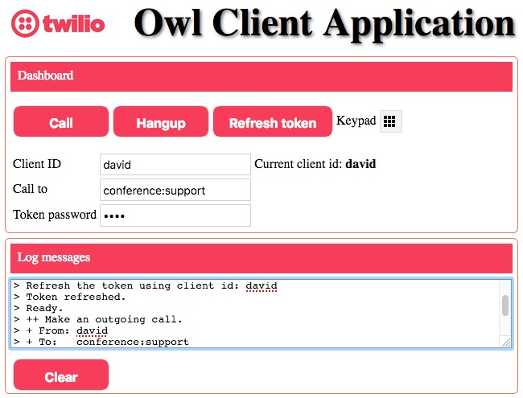

# Owl Client Application Version 2

These are the steps to implement a Twilio JavaScript Web Client using Twilio Functions.

Owl Client Screen print:



[](https://heroku.com/deploy?template=https://github.com/tigerfarm/owlc)

When you deploy to Heroku, you will be prompted for an app name. 
The name needs to be unique, example, enter your name+cc (example: davidcc). 
Click Deploy app. Once the application is deployed, click Manage app. 
Set Heroku project environment variables by clicking Settings. 
Click Reveal Config Vars. Add the following key value pair:
````
TOKEN_HOST=your_Twilio_Functions_domain (example: about-time-1235.twil.io)
````

Requirements:

- Twilio account. A free Trial account will work.
- NodeJS installed to run the Client locally on your computer.
Or a website that runs PHP programs such as Heroku. PHP is very common with service providers.

## Files

The Client files:
- [index.html](index.html) : Twilio JavaScript (JS) Client to make and receive phone calls.
- [custom/app.css](custom/app.css) : Styles

The server files:
- [nodeHttpServer.js](nodeHttpServer.js) : a NodeJS HTTP Server that serves the Client files and calls clientTokenGet.php.
This is used to run the Twilio Client locally on a computer.
- [clientTokenGet.php](clientTokenGet.php) : a program that calls your Twilio Function (generateToken.js).
This is used when hosting the Twilio Client remotely on a public PHP website.

Twilio NodeJS Functions
- [generateToken.js](generateToken.js) : generates and returns a Client capability token.
- [makecall.js](makecall.js) : provides TwiML to make phone calls.

Heroku Hosting Service
- [app.json](app.json) : Heroku deployment file to describe the application.
- [composer.json](composer.json) : Heroku deployment file which sets the programming language used.

## Implementation

The server side can run locally on a computer using NodeJS, or run on a website that runs PHP programs.

### Local Server Side Setup using a NodeJS Webserver

Download the project zip file.

    https://github.com/tigerfarm/OwlClient

1. Click Clone or Download. Click Download ZIP.
2. Unzip the file into a work directory.
3. Change into the unzipped directory: OwlClient-master.

Install the NodeJS "request" module:
    
    $ npm install request

Run the NodeJS HTTP server.

    $ node nodeHttpServer.js
    +++ Start: nodeHttpServer.js
    Static file server running at
      => http://localhost:8000/
    CTRL + C to shutdown
    ...
    
Use a browser to access the Twilio Client:

    http://localhost:8000/index.html
    
Next, add Twilio Functions.

### Remote Server Side Setup using a PHP Webserver

Download the project zip file. Unzip the file into your website's CGI bin directory, or in any directory that will automatically run clientTokenGet.php as PHP program when called from HTTP. Test by displaying the Client in your browser, example URL:

    https://example.com/cgi/index.html

### Add Twilio Functions

You will need to replace the sample domain name, "about-time-6360.twil.io," with your Runtime Domain name.
You can view your Runtime Domain name at this link:

[https://www.twilio.com/console/runtime/overview](https://www.twilio.com/console/runtime/overview)

Create a Twilio Function to generate client capability tokens.
In the Console, go to:

[https://www.twilio.com/console/runtime/functions](https://www.twilio.com/console/runtime/functions)
    
1. Click the Create Function icon (circle with plus sign in the middle).
2. Click Blank. Click Create.
   - Properties, Function Name: Generate Client Token
   - URL Path: https://about-time-6360.twil.io /generateToken (note, your domain is display here)
   - Uncheck Configuration, Access Control to allow Twilio JS Client access.
   - Copy and paste the contents of [generateToken.js](generateToken.js) into the Code box.
3. Click Save.

Create a Twilio Function to provide TwiML to make phone calls.

[https://www.twilio.com/console/runtime/functions](https://www.twilio.com/console/runtime/functions)
    
1. Click the Create Function icon (circle with plus sign in the middle).
2. Click Blank. Click Create.
   - Properties, Function Name: Make a call
   - URL Path: https://about-time-6360.twil.io /makecall (note, your domain is display here)
   - For testing, uncheck Configuration, Access Control to allow accessible from a browser.
   - Copy and paste the contents of [makecall.js](makecall.js) into the Code box.
3. Click Save.

Create a Voice TwiML Application entry using the above Twilio Function URL.
In the Console, go to:

[https://www.twilio.com/console/voice/runtime/twiml-apps](https://www.twilio.com/console/voice/runtime/twiml-apps)
    
1. Click Create new TwiML Ap
2. Enter the following:
   - Friendly name: Make a call 
   - Voice, Request URL: https://about-time-6360.twil.io/makecall (Use URL of above, with your domain name)
3. After clicking Save, go back into the app entry to get the app SID.
   - The SID is used when creating a Function environment variable.
   - Example: APeb4627655a2a4be5ae1ba962fc9576cf

### Twilio Function Configuration

Configure your account's Twilio Functions settings.
In the Console, go to:
    
[https://www.twilio.com/console/runtime/functions/configure](https://www.twilio.com/console/runtime/functions/configure)
    
Check: Enable ACCOUNT_SID and AUTH_TOKEN.
- This allows your Functions to access your account SID and auth token as environment variables.

Create Function Environment Variables.

    (Key : value)
    CLIENT_ID : Example, owluser (Your default Client identity attribute, no spaces)
    CLIENT_PHONE_NUMBER : Example, +12223331234 (Your Twilio phone number)
    TOKEN_PASSWORD : value to protect someone using your client.
    
    VOICE_TWIML_APP_SID_CALL_CLIENT : Example: APeb4627655a2a4be5ae1ba962fc9576cf
    (API key code to a Twilio Function URL)
    This is used in the token. This links the token Function to the TwiML provider Function.
    
    Click Save, to save the environment variables.

Update your Twilio Function host name into the Twilio Client server side programs.
You can view the host name by going to the following link. The host name, is Your Runtime Domain name.

[https://www.twilio.com/console/runtime/overview](https://www.twilio.com/console/runtime/overview)

    If you are using the NodeJS webserver, edit: nodeHttpServer.js.
    If you are using a remote webserver with PHP, edit: clientTokenGet.php.
    Change:
       tokenHost = "about-time-1235.twil.io";
    to use your Twilio Function host name.
    
    If you are running nodeHttpServer.js. Restart it.

## Ready to Test

If running locally, use a browser to access the Twilio Client:

    http://localhost:8000/index.html

If on a website, use a browser to access the website Twilio Client URL, example:

    http://example.com/index.html

1. Click Call and hear a message from the Twilio Voice service, "Error placing the call. The to-caller is required."

2. In the to-caller field, enter: conference:support. Click Call, and you will be connect to the Twilio conference named, support. You will hear the classic Twilio conference music. Ask someone to join the conference.

Click Hangup to disconnect the conference call.

3. Test token refresh. In a separate tab, go to your call logs:

https://www.twilio.com/console/voice/logs/calls

Note, the recent call is from caller, owluser, which is this Twilio Client's default client identity.
Enter your name (no spaces) as the clientid (From). Click Call. Refresh the call logs. Note, the call is from your name.

4. Call your mobile phone number.

5. Have someone else use the Twilio Client with different client id, then call them.

Note, you can call a sip address, example, sip:david@davidsubdomain.sip.us1.twilio.com.

Cheers...
