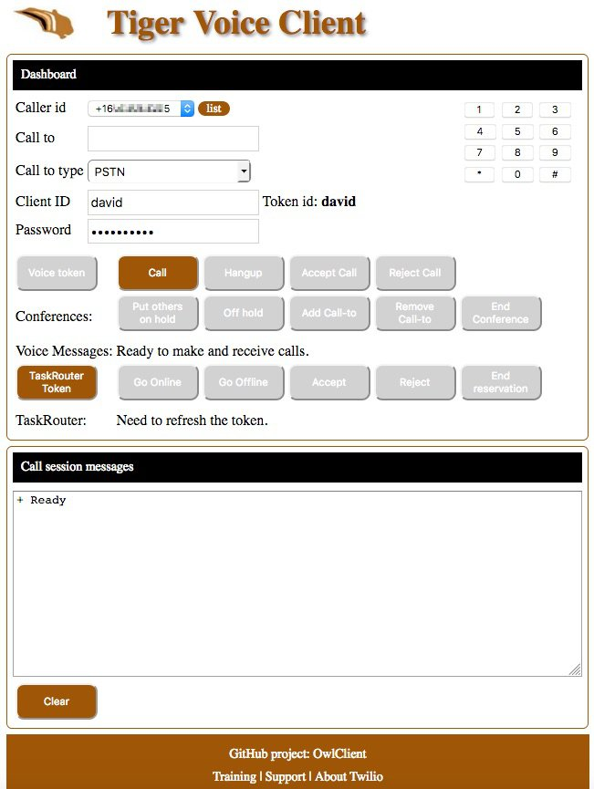

# Tiger Voice Client Application Version 3.1

This application is used by people to make and receive Twilio voice calls from their browser.
It has conference call features for a soft transfer.
It can be used by a TaskRouter Worker agent to manage their status and accept calls.

Requirements:

- For non-developers and developers: you will need a Twilio account. A free Trial account will work.
- For non-developers, you will need an [Heroku account](https://heroku.com/) to host your application.
- For developers, I have included a Node.JS webserver program that you can run locally on your computer.
  Or, you can also run this application on a website that has a PHP runtime environment.

Note, no development required to run this application. It can be completely deployed and tested from a web browser.

[](https://heroku.com/deploy?template=https://github.com/tigerfarm/OwlClient)

When you deploy to Heroku, you will be prompted for an app name. 
The name needs to be unique. Example, enter your name+vc (example: davidvc). 
Click Deploy app. Once the application is deployed, click Manage app. 
Set Heroku project environment variables by clicking Settings. 
Click Reveal Config Vars. Add the following key value pairs:
````
ACCOUNT_SID : your_account_SID (starts with "AC", available from Twilio Console)
AUTH_TOKEN : your_account_auth_token (Available from Twilio Console)
TOKEN_HOST : your_Twilio_Functions_domain (example: about-time-1235.twil.io)
TOKEN_PASSWORD : your_token_password (Password is required to create tokens. You create the password for your users)
WORKSPACE_SID : your_TaskRouter_workspace_sid (Only required if you are using TaskRouter)
````
To redeploy,
````
To keep the same URL, remove the old app by using the Heroku dashboard:
    https://dashboard.heroku.com,
    Select the app, click Settings, go to the bottom, click Delete app.
Then, from, https://github.com/tigerfarm/OwlClient, click Deploy to Heroku button.
Note, you will need to re-enter the above Config Vars.
````

Tiger Client Screen print:



## Twilio Console Configurations

### Add Twilio Functions

1. Create a Twilio Function to generate client capability tokens.
2. Create a Twilio Function to provide TwiML to make phone calls.
3. Create a Voice TwiML Application entry using the above Twilio Function URL (make phone calls).
4. Configure your account's Twilio Functions settings.
5. Test.

In the following, you will need to replace the sample domain name, "about-time-1235.twil.io," with your Runtime Domain name.
You can view your Runtime Domain name at this link:

[https://www.twilio.com/console/runtime/overview](https://www.twilio.com/console/runtime/overview)

1 - Create a Twilio Function to generate client capability tokens.
In the Console, go to:

[https://www.twilio.com/console/runtime/functions](https://www.twilio.com/console/runtime/functions)
    
1. Click the Create Function icon (circle with plus sign in the middle).
2. Click Blank. Click Create.
   - Properties, Function Name: Generate Client Token
   - URL Path: https://about-time-1235.twil.io /tokenclient (note, your domain is display here)
   - Uncheck Configuration, Access Control to allow Twilio JS Client access.
   - Copy and paste the contents of [tokenclient.js](tokenclient.js) into the Code box.
3. Click Save.

2 - Create a Twilio Function to provide TwiML to make phone calls.

[https://www.twilio.com/console/runtime/functions](https://www.twilio.com/console/runtime/functions)
    
1. Click the Create Function icon (circle with plus sign in the middle).
2. Click Blank. Click Create.
   - Properties, Function Name: Make a call
   - URL Path: https://about-time-1235.twil.io /makecall (note, your domain is display here)
   - For testing, uncheck Configuration, Access Control to allow accessible from a browser.
   - Copy and paste the contents of [makecall.js](makecall.js) into the Code box.
3. Click Save.

3- Create a Voice TwiML Application entry using the above Twilio Function URL.
This is used in the token to link to the Function whichs makes the phone calls.
In the Console, go to:

[https://www.twilio.com/console/voice/runtime/twiml-apps](https://www.twilio.com/console/voice/runtime/twiml-apps)
    
1. Click Create new TwiML App
2. Enter the following:
   - Friendly name: Make a call 
   - Voice, Request URL: https://about-time-1235.twil.io/makecall (Use URL of above, with your domain name)
3. After clicking Save, go back into the app entry to get the app SID.
   - The SID is used when creating a Function environment variable.
   - Example: APeb4627655a2a4be5ae1ba962fc9576cf

4 - Configure your account's Twilio Functions settings.
In the Console, go to:
    
[https://www.twilio.com/console/runtime/functions/configure](https://www.twilio.com/console/runtime/functions/configure)
    
1. Check: Enable ACCOUNT_SID and AUTH_TOKEN. This allows your Functions to access your account SID and auth token as environment variables.
2. Create Function Environment Variables.

    Key : value

    TOKEN_PASSWORD : your_password_to_generate_tokens (user enters the password in the web application form)

    VOICE_TWIML_APP_SID_CALL_CLIENT : Example: APeb4627655a2a4be5ae1ba962fc9576cf
    (API key code to a Twilio Function URL)

    Click Save, to save the environment variables.

Update your Twilio Function host name into the Twilio Client server side programs.
You can view the host name by going to the following link. The host name, is Your Runtime Domain name.

[https://www.twilio.com/console/runtime/overview](https://www.twilio.com/console/runtime/overview)

    If you are using the NodeJS webserver, edit: nodeHttpServer.js.
    If you are using a remote webserver with PHP, edit: clientTokenGet.php.
    Change:
       tokenHost = "about-time-1235.twil.io";
    to use your Twilio Function host name.
    
    If you are running nodeHttpServer.js. Restart it.

5 - Testing Steps

If on the Heroku website, use a browser to access the website Twilio Client URL,
example (replace "mytwilioclient" with your Heroku application name):

    https://mytwilioclient.herokuapp.com/

1. Enter a Client ID, example your first name. Enter your Token password.
2. Click Refresh token. The message, Token refreshed, is displayed.
3. In the "Call to" field, enter: support. Select Call to type: Conference.
4. Click Call, and you will be connect to the Twilio conference named, support.
    You will hear the classic Twilio conference music.
5. In another browser, use Tiger Voice Client, with different Client ID, join the conference.
6. Click Hangup to disconnect from the conference, or click End conference to disconnect all participants in the conference.
7. View the call log. In a separate tab, log into the Twilio Console.
    Beside Call to, click, See log.
8. Call your mobile phone number.
   In the "Call to" field, enter your mobile phone number.
   Select Call to type: PSTN.
   Click Call, and your mobile phone will be dialed.
9. Have someone else use this Voice Client, with different Client ID. Call them.
   In the "Call to" field, enter the other person's Client ID.
   Select Call to type: Twilio Client.
   Click Call, and you will be connected to the other client.
   They will need to Accept the call, for you to talk together.

## Conference Call Features

These features allow a soft transfer.
Once you have created a conference and are in the conference, you can put the other participant (or participants) on hold.
You can enter a PSTN phone number in the Call to field, and click Add Call-to to dial the phone number.
If the person answers, they are included in the conference call. The person on hold cannot hear your conversation with the new person.
You can to talk to the person, and either keep them on the call or click Remove Call-to to remove them from the call.
Remove Call-to, is useful if you get the person's voicemail.
Or, you can take the other participant off hold, and they can also talk with the person who has newly been added to the call.
At this stage, you can click Hangup to disconnect yourself from the call and the other 2 can continue talking, which completes the soft transfer.

Note, use Hangup to disconnect yourself from the call. Use End Conference to end the conference which disconnects all participants from the conference.

TwiML Bin for having a person join the conference:
````
<?xml version=“1.0" encoding=“UTF-8”?>
<Response>
  <Dial>
    <Conference>
    {{conferenceid}}
    </Conference>
  </Dial>
</Response>
````

Use the above TwiML Bin URL in [conferenceJoin.php](conferenceJoin.php).

## TaskRouter Features

Your agents need to be configured as TaskRouter Workers, if they are to use the TaskRouter features.
Click [here](https://www.twilio.com/blog/2018/06/customize-phone-call-workflows-twilio-studio-taskrouter.html),
to get instructions on how to configure a TaskRouter call queue and workers (agents).
Notes, skip section: Configure an Agent Worker Activity, because it is not required with Tiger Voice Client.
Also, skip the section: Implement the Agent Web Application, if your agents will be only using Tiger Voice Client and not using their mobile phone to accept TaskRouter calls.

The Worker name (example: "david") and client "contact_uri" (example: "client:david") need to match.
And, the name needs to match with the Tiger Voice Client ID value (example: "david").
See the following screen prints.
This is how the Client links to the TaskRouter Worker configuration.

Once configured, the agent can start their Tiger Voice Client, get a voice and TaskRouter token, and then
set them self to available for a call, by clicking Go Online.
When TaskRouter has a caller for the agent, the agent be given the option to Accept or Reject the call.
If they Accept, they will be connected to the caller.


## For Developers

### Files

The Client files:
- [index.html](index.html) and [client.js](client.js) : Twilio Client HTML and JavaScript (JS) files to make and receive phone calls.
- [custom/app.css](custom/app.css) : Styles
- [clientTr.js](clientTr.js) : JavaScript (JS) file for TaskRouter Worker options.

The server files:
- [nodeHttpServer.js](nodeHttpServer.js) : a NodeJS HTTP Server that serves the Client files and calls clientTokenGet.php.
This is used to run the Twilio Client locally on a computer.
- [clientTokenGet.php](clientTokenGet.php) : a program that calls your Twilio Function (tokenclient.js).
This is used when hosting the Twilio Client remotely on a public PHP website.

Twilio NodeJS Functions
- [tokenclient.js](tokenclient.js) : generates and returns a Client capability token.
- [makecall.js](makecall.js) : provides TwiML to make phone calls.

Heroku Hosting Service
- [app.json](app.json) : Heroku deployment file to describe the application.
- [composer.json](composer.json) : Heroku deployment file which sets the programming language used.

## Local host Implementation

The server side can run locally on a computer using NodeJS, or run on a website that runs PHP programs.

Note, the Twilio Node.JS helper library is not required.

### Local Server Side Setup using a NodeJS Webserver

Download the project zip file.

    https://github.com/tigerfarm/OwlClient

1. Click Clone or Download. Click Download ZIP.
2. Unzip the file into a work directory.
3. Change into the unzipped directory: OwlClient-master.

Install the NodeJS "request" module:
    
    $ npm install request

Run the NodeJS HTTP server.

    $ node nodeHttpServer.js
    +++ Start: nodeHttpServer.js
    Static file server running at
      => http://localhost:8000/
    CTRL + C to shutdown
    ...
    
Use a browser to access the Twilio Client:

    http://localhost:8000/index.html
    
Next, add Twilio Functions.

### Remote Server Side Setup using a PHP Webserver

Download the project zip file. Unzip the file into your website's CGI bin directory, or in any directory that will automatically run clientTokenGet.php as PHP program when called from HTTP. Test by displaying the Client in your browser, example URL:

    https://example.com/cgi/index.html

## Ready to Test

If running locally, use a browser to access the Twilio Client:

    http://localhost:8000/index.html

Use the above testing steps.

Cheers...
